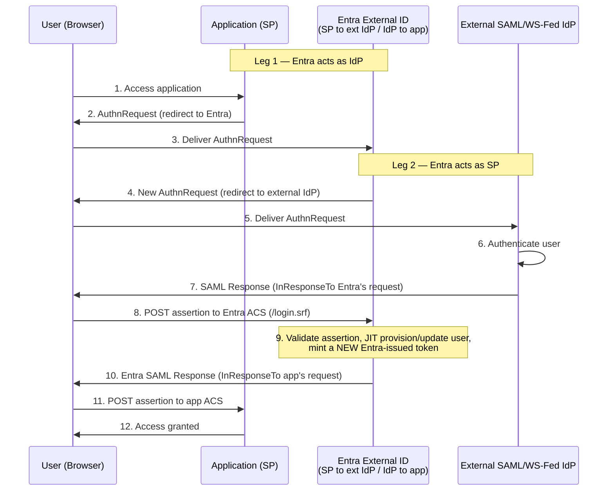

### When Entra External ID federates to an external SAML/WS-Fed IdP, are there two separate SAML flows occuring when signing user into Entra app?

Yes. When an app signs in a user through Microsoft Entra External ID **and** that user is homed on an external SAML/WS-Fed identity provider that has been federated with Entra via [Add federation with SAML/WS-Fed identity providers](https://learn.microsoft.com/en-us/entra/external-id/direct-federation), there are **two independent SAML exchanges** chained together. Entra sits in the middle as an **identity broker**, acting as both a service provider and an identity provider at the same time:

| Leg | Entra's role | Who sends the `AuthnRequest` | Who issues the assertion |
|---|---|---|---|
| **Leg 1 — App ↔ Entra** | Entra is the **IdP** | The **app** (SP) | **Entra** issues its own token to the app |
| **Leg 2 — Entra ↔ External IdP** | Entra is the **SP / relying party** | **Entra** | The **external IdP** (Salesforce, AD FS, etc.) |

Each leg is a separate trust relationship with its own certificates/signing keys and its own assertion.

**Key points**

* **Both legs are SP-initiated**. The app initiates against Entra, and Entra initiates against the external IdP. This is why IdP-initiated SSO isn't supported on Leg 2 — Entra always sends its own AuthnRequest first, so an unsolicited assertion has no matching request to correlate against.
* **The external IdP's assertion is not passed through to the app**. Entra consumes it, resolves/provisions the user (just-in-time), and then issues a fresh token of its own to the app. The app never sees the external IdP's assertion.
* **Two different ACS endpoints are involved**: the external IdP posts to Entra's ACS (https://login.microsoftonline.com/login.srf), and Entra posts to the app's ACS.
* **Leg 1 is often OIDC rather than SAML**. For External ID customer apps, the app ↔ Entra leg is commonly OpenID Connect (the recommended path), while only Leg 2 is SAML/WS-Fed. The two-hop broker model holds either way.
